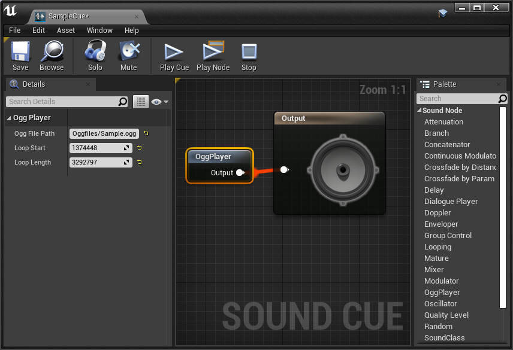

# ue4-simple-ogg-player
Unreal Engine 4でイントロ付きoggを再生するプラグインです。

## 仕様

* ループ開始点とループ長を指定することで、なめらかなイントロ付きループを実現
* v0.10.x現在、uassetファイルは未対応。直接ファイルパスを指定します
* v0.10.x現在、oggの組み込みタグによるループはできません

## 動作環境

* UE4.25.4
* UE4.26.1
* UE5.0 EA

## 使い方

1. Plugins/SimpleOggPlayerをプロジェクトのPluginsフォルダに入れてください
1. .oggファイルをプロジェクトのContentフォルダの任意の場所に入れてください
1. Sound Cueを作成し、下記のようにOggPlayerというノードを追加します

1. パラメータを入力します
    * Ogg File Pathには、Contentフォルダからのoggファイルの相対パス
    * Loop Startはループ開始地点のサンプル数
    * Loop Lengthにはループするサンプル数
1. Cueを再生するとoggをループ付きで再生できます

## ライセンス
MIT

## 更新履歴
* 2022/01/08 v0.10.2 C++からUSoundNodeOggPlayerを参照できるように修正
* 2021/02/07 v0.10.1 不正なファイルパスに変更しても再生ができてしまう不具合修正
* 2021/01/29 v0.10公開

